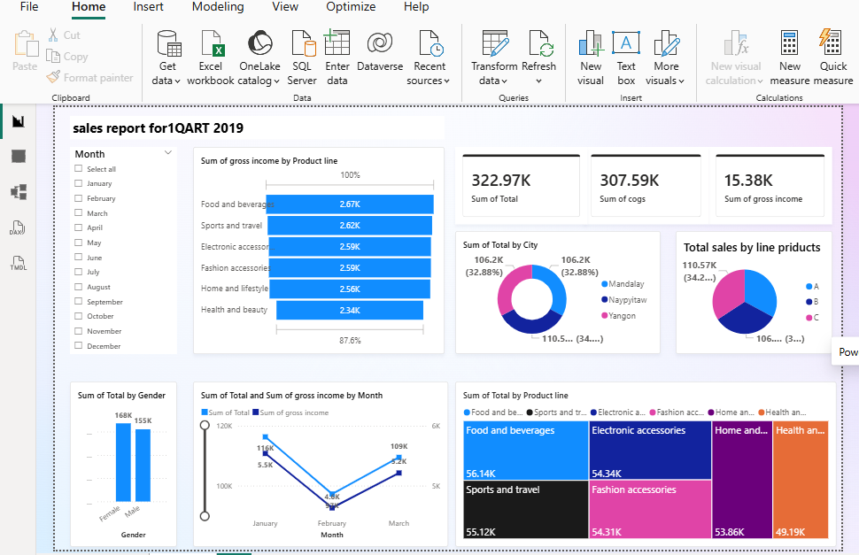

# Supermarket-sales
Power BI dashboard project that visualizes supermarket sales data and key metrics such as total sales, COGS, and gross income.في الأعلى يوجد مؤشرات رئيسية للمبيعات:

إجمالي المبيعات: 322.97K

تكلفة البضائع: 307.59K

الربح الإجمالي: 15.38K

على اليسار يوجد فلتر الشهور بحيث يمكن اختيار شهر معين لعرض بياناته فقط.

يوجد عدة رسومات بيانية لتحليل المبيعات مثل:

مبيعات حسب نوع المنتج (مثل الطعام والمشروبات، الإلكترونيات، الأزياء…).

المبيعات حسب المدينة (Mandalay – Naypyitaw – Yangon).

توزيع المبيعات حسب خط المنتجات.

المبيعات حسب الجنس (ذكر / أنثى).

المبيعات والأرباح حسب الشهر بخط بياني.

مخطط شجري (Treemap) يوضح حجم المبيعات لكل فئة منتجات.

📊 الهدف من هذه اللوحة هو تحليل أداء المبيعات بطريقة بصرية سهلة لمعرفة:

أكثر المنتجات مبيعًا

المدن الأعلى في المبيعات

تغير المبيعات عبر الشهور

الفرق بين العملاء الذكور والإناث.

